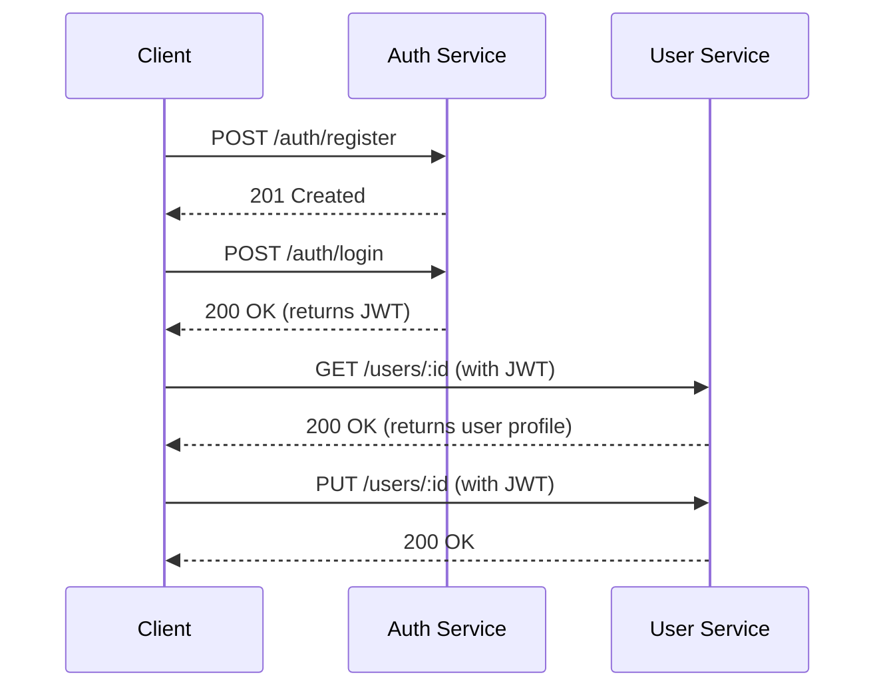

# Project Requirements Document (PRD): User & Auth Microservices

## 1. Goal / Purpose

The primary goal of this project is to build the smallest possible microservice-based system to understand service boundaries, JWT authentication, and inter-service communication. This project lays the foundation for all future microservices work.

## 2. Scope

You will build two separate services, each in its own repository:

-   **Service 1: Auth Service**
    -   Handles user registration.
    -   Handles user login.
    -   Manages password hashing.
    -   Issues JWT access tokens.

-   **Service 2: User Service**
    -   Handles CRUD operations for user profiles (secured with JWT).
    -   Validates JWTs, either via an internal call or a shared secret.

## 3. Architecture Overview

Both services communicate exclusively via HTTP REST, and each service maintains its own separate database.



## 4. Functional Requirements

### Auth Service

| Feature         | Endpoint         | Method | Description                               |
| --------------- | ---------------- | ------ | ----------------------------------------- |
| Register User   | `/auth/register` | POST   | Creates a new user account.               |
| Login User      | `/auth/login`    | POST   | Validates user credentials & returns JWT. |

-   **Data Model:**
    ```json
    {
        "id": "uuid",
        "email": "string (unique)",
        "password_hash": "string",
        "created_at": "timestamp"
    }
    ```
-   **JWT Payload:**
    ```json
    {
        "sub": "user_id",
        "email": "user_email",
        "iat": "timestamp",
        "exp": "timestamp"
    }
    ```

### User Service

| Feature             | Endpoint      | Method | Auth Required |
| ------------------- | ------------- | ------ | ------------- |
| Get user profile    | `/users/:id`  | GET    | Yes           |
| Update user profile | `/users/:id`  | PUT    | Yes           |
| Delete user         | `/users/:id`  | DELETE | Yes           |
| List users (Optional) | `/users`      | GET    | Yes           |

-   **Data Model:**
    ```json
    {
        "id": "uuid",
        "name": "string",
        "email": "string",
        "bio": "string",
        "created_at": "timestamp",
        "updated_at": "timestamp"
    }
    ```

## 5. Tech Stack (Recommended)

You can swap alternatives later, but starting with a simple stack is recommended.

-   **Language:** Node.js (Express/Fastify), Python (Flask), or Java (Spring Boot).
-   **Database:** PostgreSQL, MySQL, or MongoDB (a separate database for each service).
-   **Auth:** JWT (using the HS256 algorithm).
-   **Containerization:** Docker (optional but strongly recommended).

## 6. Security Requirements

-   Passwords must be stored using a strong hashing algorithm (e.g., bcrypt, Argon2).
-   JWTs must be validated on all protected endpoints.
-   Token expiration must be enforced.
-   No raw passwords should ever be returned in API responses.

## 7. Deployment Requirements

Phase 1 should support local development only, but with future scaling in mind.

-   **/auth-service**
    -   `src/`
    -   `package.json`
    -   `Dockerfile`
-   **/user-service**
    -   `src/`
    -   `package.json`
    -   `Dockerfile`

An optional `docker-compose.yml` can be added to run both services together.

## 8. Non-Functional Requirements

| NFR             | Requirement                               |
| --------------- | ----------------------------------------- |
| **Performance** | <200ms response time per request.         |
| **Scalability** | Each service must run independently.      |
| **Maintainability** | Clear folder structure, separate repos.   |
| **Observability** | Basic logs for each request.              |
| **Fault Tolerance** | Graceful error handling.                  |

## 9. Out of Scope (For Now)

The following features are not part of the initial scope but may be considered in the future:

-   API Gateway
-   Message Broker
-   Service Discovery
-   Microservice orchestration (e.g., Kubernetes)
-   Refresh tokens
-   Email verification
-   Role-Based Access Control (RBAC)

## 10. Deliverables

-   Two independent, fully working services.
-   A complete end-to-end flow: register → login → call a protected user endpoint.
-   Postman/Thunder Client tests or cURL commands for API validation.
-   A `README.md` for each service with setup and usage instructions.
