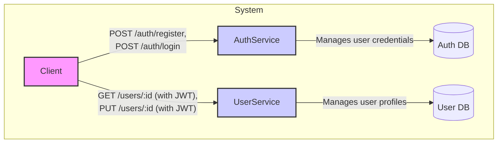

# System Design Document: User & Auth Microservices

This document outlines the system design for a minimal microservice-based system to demonstrate service boundaries, JWT authentication, and inter-service communication.

## 1. Goals and Constraints

-   **Goal:** To learn microservice boundaries, stateless JWT authentication, and inter-service communication by building two services: an **Auth Service** and a **User Service**.
-   **Constraints:**
    -   Keep the setup simple for local development.
    -   Two separate repositories.
    -   Separate databases for each service.
    -   Communication via HTTP REST only.
    -   HS256 for JWT signing is acceptable for a proof-of-concept, but RS256 is recommended for production.
    -   Use Docker for local containerization.
    -   No API Gateway, message brokers, refresh tokens, or RBAC in this phase.

## 2. High-Level Architecture

The system consists of a **Client**, an **Auth Service**, and a **User Service**. The client interacts with both services, while the services themselves are decoupled.



**Design Decision:** The **User Service** validates JWTs locally by verifying the signature, avoiding a round-trip to the **Auth Service**. This approach is faster and keeps the services independent.

## 3. Components and Responsibilities

### 3.1. Auth Service

The **Auth Service** is responsible for user authentication and token issuance.

-   **Responsibilities:**
    -   Registering users (hashing and storing passwords).
    -   Logging users in (verifying passwords).
    -   Issuing signed JWT access tokens with a short expiration.
    -   Managing signing keys.

-   **Public API:**
    -   `POST /auth/register`:
        -   **Request:** `{ "email": "...", "password": "..." }`
        -   **Response:** `201 { "id": "...", "email": "...", "created_at": "..." }`
    -   `POST /auth/login`:
        -   **Request:** `{ "email": "...", "password": "..." }`
        -   **Response:** `200 { "access_token": "<JWT>", "token_type": "Bearer", "expires_in": 3600 }`

-   **Data Model (Auth DB):**
    ```json
    {
        "id": "uuid",
        "email": "string (unique)",
        "password_hash": "string",
        "created_at": "timestamp"
    }
    ```

-   **Security Rules:**
    -   Use a salted, slow hashing algorithm like **bcrypt** or **Argon2**.
    -   Never return the password hash in any response.
    -   Validate all inputs (e.g., email format, password length).
    -   Rate-limit the login endpoint in production.

-   **JWT Design:**
    -   The JWT payload should include `sub` (user ID), `email`, `iat` (issued at), and `exp` (expiration time).
    -   Use **HS256** for the POC, but prefer **RS256** for production to avoid sharing secrets across services.
    -   Keep token lifetimes short (e.g., 15 minutes to 1 hour).

### 3.2. User Service

The **User Service** is responsible for managing user profiles.

-   **Responsibilities:**
    -   CRUD operations for user profiles (e.g., name, bio).
    -   Validating JWTs on all protected endpoints.
    -   Communicating with its own database for profile data.

-   **Public API:**
    -   `GET /users/:id` (Protected)
    -   `PUT /users/:id` (Protected)
    -   `DELETE /users/:id` (Protected)
    -   `GET /users` (Optional, protected, paginated)

-   **Data Model (User DB):**
    ```json
    {
        "id": "uuid",
        "name": "string",
        "email": "string",
        "bio": "string",
        "created_at": "timestamp",
        "updated_at": "timestamp"
    }
    ```

-   **JWT Validation:**
    -   Verify the token's signature using the shared HS256 secret or the RS256 public key.
    -   Verify the `exp` and `iat` claims.
    -   Ensure the `sub` claim exists.

## 4. API Contracts (cURL Examples)

-   **Register:**
    ```bash
    curl -X POST -H "Content-Type: application/json" \
      -d '{"email":"a@b.com","password":"S3cureP@ss"}' \
      http://localhost:3000/auth/register
    ```

-   **Login:**
    ```bash
    curl -X POST -H "Content-Type: application/json" \
      -d '{"email":"a@b.com","password":"S3cureP@ss"}' \
      http://localhost:3000/auth/login
    ```

-   **Get User (Protected):**
    ```bash
    curl -H "Authorization: Bearer <TOKEN>" http://localhost:4000/users/<id>
    ```

## 5. Data Storage and Schema

-   Use **Postgres** for both services, with separate databases to avoid coupling.
-   Use UUIDs as primary keys.
-   Add a `UNIQUE` index on the `email` column in the Auth database.
-   Use a connection pool to manage database connections efficiently.

## 6. Security Checklist

-   [ ] Passwords are hashed with **bcrypt** or **Argon2**.
-   [ ] JWT signatures are verified on every protected endpoint.
-   [ ] Signing keys and secrets are stored outside the repository (e.g., environment variables).
-   [ ] HTTPS is used in all non-local environments.
-   [ ] The login endpoint is rate-limited.
-   [ ] No sensitive data (passwords, full JWTs) is logged.

## 7. Observability and Error Handling

-   **Logging:** Log the timestamp, service, endpoint, method, status, and latency for each request.
-   **Correlation ID:** Use an `X-Request-Id` header to trace requests across services.
-   **Health Checks:** Expose a `/health` endpoint to report the status of the service and its database connection.
-   **Errors:** Return structured error messages with appropriate HTTP status codes.

## 8. Local Deployment and Repo Layout

-   **Repository Layout (per service):**
    ```
    /auth-service
    ├─ src/
    │   ├─ controllers/
    │   ├─ services/
    │   ├─ models/
    │   └─ index.js
    ├─ package.json
    ├─ Dockerfile
    └─ .env.example
    ```
-   **Docker Compose:** Use a `docker-compose.yml` file to run the auth service, user service, and their respective databases locally.

## 9. Future Improvements

-   **RS256 + JWKS:** Implement RS256 for JWT signing and expose a JWKS endpoint for public key distribution.
-   **Refresh Tokens:** Add support for refresh tokens to allow for longer-lived sessions.
-   **API Gateway:** Introduce an API Gateway to centralize authentication, rate limiting, and other cross-cutting concerns.
-   **Service Discovery:** Use a service discovery mechanism (e.g., Consul, Eureka) for dynamic service registration and discovery.
-   **Orchestration:** Deploy the services to a container orchestrator like Kubernetes.