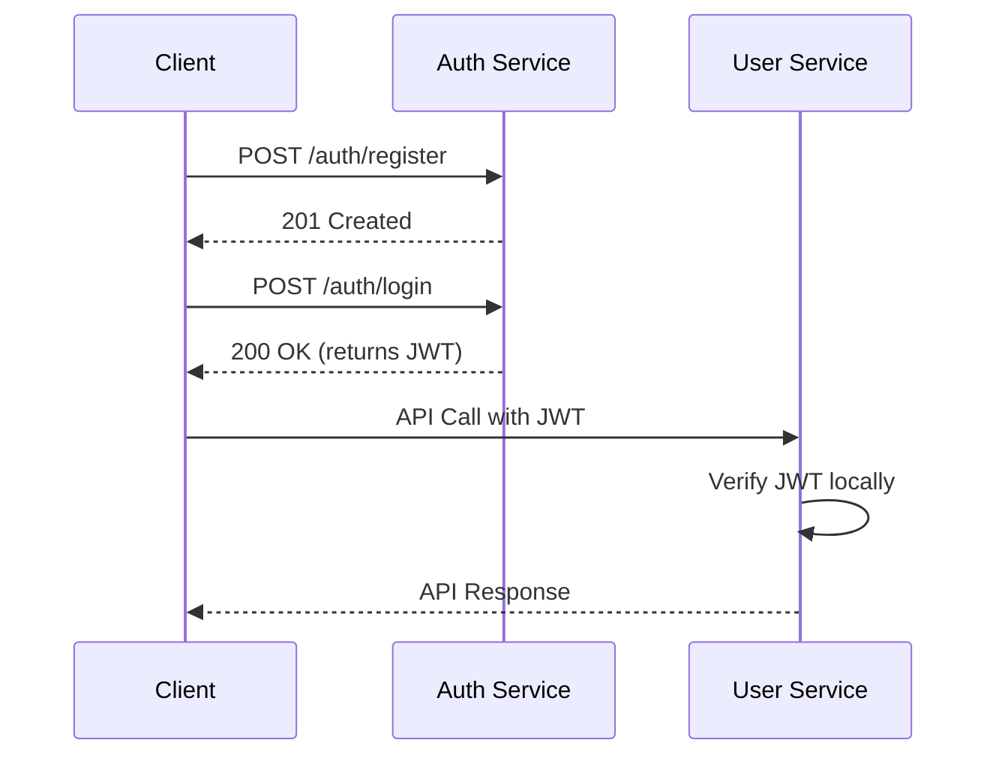

# Auth Service Design Document

This document provides a detailed design for the **Auth Service**, a single-responsibility microservice for handling user authentication and token issuance.

## 1. Purpose

The **Auth Service** is responsible for:

-   **User Registration:** Storing user credentials with hashed passwords.
-   **User Login:** Verifying user credentials.
-   **Token Issuance:** Issuing signed JWT access tokens with a short lifespan.

This service is the single source of truth for user authentication.

## 2. Tech Stack

-   **Language:** Python with FastAPI.
-   **Database:** PostgreSQL (in a dedicated database).
-   **JWT Library:** `python-jose` or `PyJWT`.
-   **Password Hashing:** **bcrypt** or **Argon2**. Argon2 is preferred for production environments.
-   **Containerization:** Docker, using multi-stage builds for smaller images.

## 3. API Contract

### `POST /auth/register`

-   **Request Body:**
    ```json
    {
        "email": "string",
        "password": "string"
    }
    ```
-   **Validations:**
    -   Validate email format.
    -   Ensure password meets minimum length requirements (e.g., >= 8 characters).
    -   Deny common or easily guessable passwords.
-   **Actions:**
    1.  Normalize the email (e.g., convert to lowercase).
    2.  Generate a UUID for the user ID.
    3.  Hash the password using **bcrypt** or **Argon2**.
    4.  Store the user's `id`, `email`, `password_hash`, and `created_at` timestamp in the database.
-   **Response:**
    -   **201 Created:**
        ```json
        {
            "id": "<uuid>",
            "email": "<email>",
            "created_at": "..."
        }
        ```
-   **Error Codes:**
    -   `400 Bad Request`: For validation errors.
    -   `409 Conflict`: If the email already exists.
    -   `500 Internal Server Error`: For unexpected server errors.

### `POST /auth/login`

-   **Request Body:**
    ```json
    {
        "email": "string",
        "password": "string"
    }
    ```
-   **Actions:**
    1.  Look up the user by email.
    2.  Use a constant-time comparison to verify the provided password against the stored hash.
    3.  If the credentials are valid, sign a new JWT and return it.
-   **Response:**
    -   **200 OK:**
        ```json
        {
            "access_token": "<JWT>",
            "token_type": "Bearer",
            "expires_in": 3600
        }
        ```
-   **Error Codes:**
    -   `401 Unauthorized`: For invalid credentials.
    -   `429 Too Many Requests`: If rate limiting is triggered.
    -   `500 Internal Server Error`.

## 4. JWT Design

-   **Claims:**
    ```json
    {
        "sub": "<user_id>",
        "email": "<user_email>",
        "iat": "<issued_at_timestamp>",
        "exp": "<expiration_timestamp>"
    }
    ```
-   **Lifetime:** The access token should have a short lifetime (e.g., 15-60 minutes).
-   **Signing Algorithm:**
    -   **POC:** **HS256** with a strong, randomly generated secret stored in an environment variable.
    -   **Production:** **RS256** (asymmetric) is recommended. The **Auth Service** holds the private key, while other services use the public key to verify tokens. This approach is more secure as it avoids sharing a secret.

## 5. Data Model (PostgreSQL)

-   **Table:** `users`
    ```sql
    CREATE TABLE users (
      id UUID PRIMARY KEY,
      email TEXT UNIQUE NOT NULL,
      password_hash TEXT NOT NULL,
      created_at TIMESTAMP WITH TIME ZONE DEFAULT now()
    );
    ```

## 6. Authentication Flow



**Note:** The **User Service** verifies the JWT locally using the public key (for RS256) or the shared secret (for HS256), which is faster and keeps the services decoupled.

## 7. Security Checklist

-   [ ] Hash passwords with **Argon2** or **bcrypt**.
-   [ ] Enforce token expiration and validate `iat` and `sub` claims.
-   [ ] Store secrets outside the codebase (e.g., in environment variables or a secret manager).
-   [ ] Rate-limit the login endpoint to prevent brute-force attacks.
-   [ ] Log authentication successes and failures, but never log raw passwords or tokens.
-   [ ] Use HTTPS in all non-local environments.

## 8. Error Responses

Use a consistent, structured format for error responses:

```json
{
    "error": {
        "code": "AUTH_INVALID_CREDENTIALS",
        "message": "Invalid email or password"
    }
}
```

## 9. Logging and Observability

-   **Request Logging:** Log essential information for each request, including a correlation ID (`X-Request-Id`).
-   **Health and Metrics:** Expose `/health` and `/metrics` endpoints for monitoring.

## 10. cURL Examples

-   **Register:**
    ```bash
    curl -X POST http://localhost:3000/auth/register \
      -H "Content-Type: application/json" \
      -d '{"email":"a@b.com","password":"S3cureP@ss"}'
    ```
-   **Login:**
    ```bash
    curl -X POST http://localhost:3000/auth/login \
      -H "Content-Type: application/json" \
      -d '{"email":"a@b.com","password":"S3cureP@ss"}'
    ```